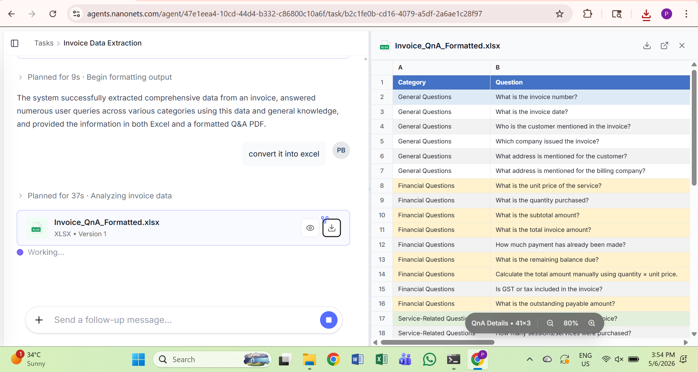
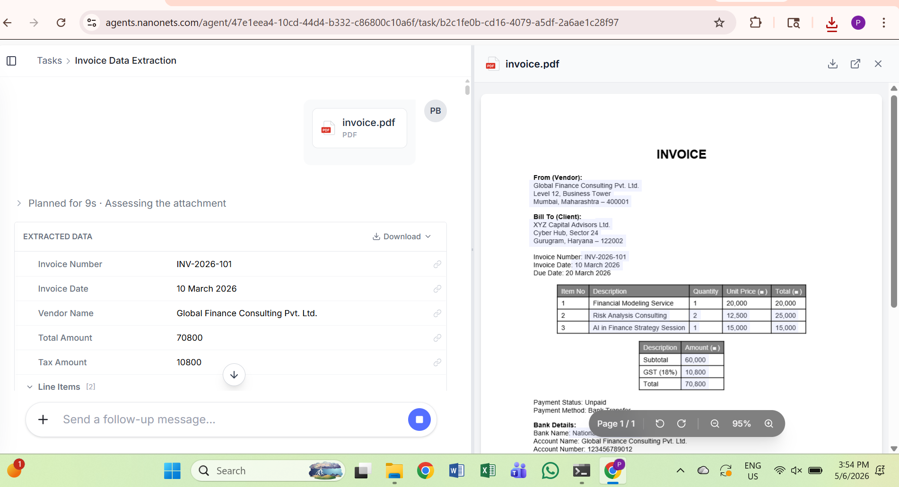
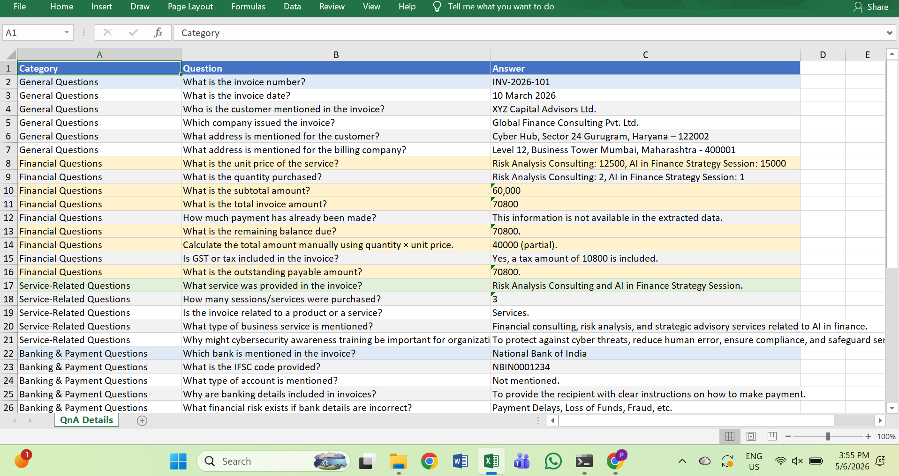
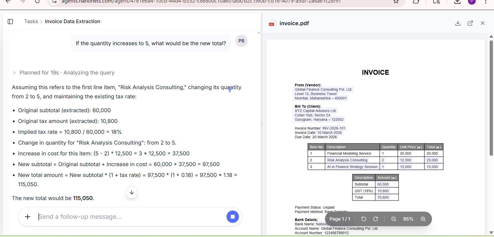
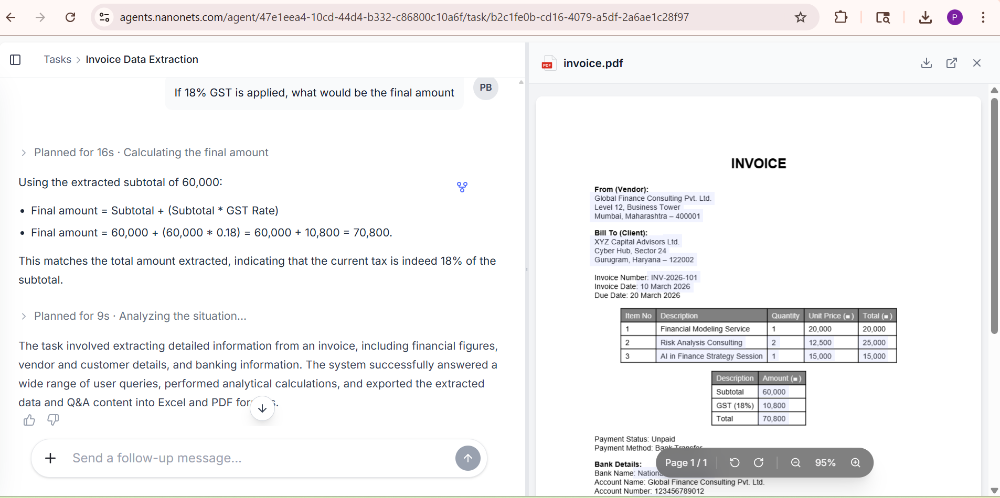

# 📄 Invoice Data Extraction & QnA Automation
This project demonstrates an AI-powered system that extracts structured information from invoices and answers different types of questions related to the invoice data. The workflow processes invoice images, extracts key information, analyzes financial details, and generates structured outputs in Excel and PDF format.

---

# 🚀 Project Overview

The system performs the following tasks:

1. Upload invoice images.
2. Extract key invoice information using AI.
3. Answer predefined questions about the invoice.
4. Categorize questions into multiple sections.
5. Generate structured output files such as Excel and formatted Q&A.

This automation helps in reducing manual invoice processing and improves efficiency in financial data analysis.

---

# 🏗️ System Architecture

The workflow of the project follows these steps:

```
Invoice Image
      ↓
AI Data Extraction
      ↓
Invoice Data Processing
      ↓
Question Categorization
      ↓
Financial Analysis
      ↓
Structured Output Generation
      ↓
Excel + QnA Report
```

---

# 📂 Project Files

| File | Description |
|-----|-------------|
| `1.png - 5.png` | Sample invoice screenshots used for processing |
| `categorywise_customer_excel.xlsx` | Extracted structured data |
| `Invoice_QnA_Formatted.xlsx` | Final categorized Q&A output |
| `README.md` | Project documentation |

---

# 📊 Output Example

The system generates a categorized Excel sheet that answers multiple types of invoice questions such as:

### General Questions
- What is the invoice number?
- What is the invoice date?
- Who is the customer?
- Which company issued the invoice?

### Financial Questions
- What is the unit price?
- What is the quantity purchased?
- What is the subtotal amount?
- What is the total invoice amount?
- What is the remaining balance?

### Service Related Questions
- What service was provided?
- How many sessions/services were purchased?

---

# 🖼️ Screenshots

## Repository Files


## Invoice Processing


## Extracted Excel Output


## QnA Formatted Output


## Final Result


---

# 🛠️ Technologies Used

- AI Document Processing
- Invoice Data Extraction
- Excel Data Formatting
- Automation Workflows

---

# 🎯 Key Features

✔ Automated invoice data extraction  
✔ Categorized question answering system  
✔ Financial calculations and analysis  
✔ Structured Excel output generation  
✔ Organized project documentation  

---

# 📌 Future Improvements

- Support multiple invoice formats
- Add PDF report generation
- Improve AI accuracy for complex invoices
- Build a dashboard for visualization

---

# 👩‍💻 Author

**Pawni Bhatia**

---

⭐ If you found this project helpful, feel free to star the repository!
